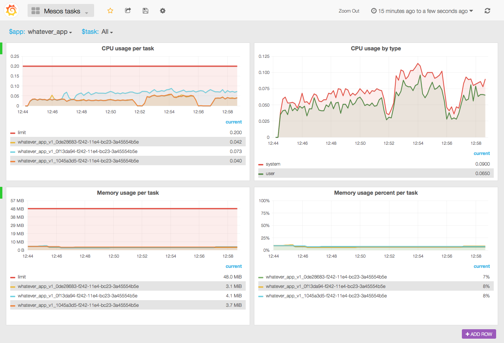

# Collect task resource usage in mesos

This is collectd plugin and docker image to collect resource usage
from mesos tasks. Resource usage collected from mesos slaves and sent
to graphite installation.

You have to add `collectd_app` label with the application name to your tasks
to make it visible in graphite. Marathon 0.8.0+ and mesos 0.22+ support that.

Also make sure to check out docker image to collect metrics from masters
and slaves: [collectd-mesos](https://github.com/bobrik/docker-collectd-mesos).

## Caveats

Mesos has an [open issue](https://issues.apache.org/jira/browse/MESOS-2713)
about incorrect CPU metrics. If you run programs that fork and die
from time to time, you would probably run into this issue. Check out
[collectd-docker](https://github.com/bobrik/collectd-docker) if you run
docker containers, it produces accurate and detailed metrics.

## Reported metrics

Metric names look like this:

```
collectd.<host>.mesos-tasks.<app>.<task>.<type>.<metric>
```

Gauges:

* `cpus_limit`
* `cpus_system_time_secs`
* `cpus_user_time_secs`
* `mem_limit_bytes`
* `mem_rss_bytes`

## Grafana dashboard

Grafana 2 [dashboard](grafana2.json) is included, you can change mesos apps
and switch to individual tasks to see resource usage.



#### Graphite metrics extracted from the dashboard

##### CPU usage per task

* Limit

```
alias(averageSeries(collectd.*.mesos-tasks.$app.$task.gauge.cpus_limit), 'limit')
```

* Per task usage

```
aliasByNode(scaleToSeconds(sumSeriesWithWildcards(derivative(collectd.*.mesos-tasks.$app.$task.gauge.cpus_{user,system}_time_secs), 1, 6), 1), 4)
```

##### CPU usage by type

* System

```
alias(sumSeriesWithWildcards(scaleToSeconds(derivative(collectd.*.mesos-tasks.$app.$task.gauge.cpus_system_time_secs), 1), 1, 4), 'system')
```

* User

```
alias(sumSeriesWithWildcards(scaleToSeconds(derivative(collectd.*.mesos-tasks.$app.$task.gauge.cpus_user_time_secs), 1), 1, 4), 'user')
```

##### Memory usage per task

* Limit

```
alias(averageSeries(collectd.*.mesos-tasks.$app.$task.gauge.mem_limit_bytes), 'limit')
```

* Per task usage in bytes

```
aliasByNode(collectd.*.mesos-tasks.$app.$task.gauge.mem_rss_bytes, 4)
```

##### Memory usage percent per task

* Limit (hidden)

```
alias(averageSeries(collectd.*.mesos-tasks.$app.$task.gauge.mem_limit_bytes), 'limit')
```

* Per task usage percent

```
aliasByNode(asPercent(collectd.*.mesos-tasks.$app.$task.gauge.mem_rss_bytes, #A), 4)
```

## Running

Minimal command:

```
docker run -d -e GRAPHITE_HOST=<graphite host> -e MESOS_HOST=<mesos host> \
    bobrik/collectd-mesos-tasks
```

### Environment variables

* `COLLECTD_HOST` - host to use in metric name, defaults to the value of `MESOS_HOST`.
* `COLLECTD_INTERVAL` - metric update interval in seconds, defaults to `10`.
* `GRAPHITE_HOST` - host where carbon is listening for data.
* `GRAPHITE_PORT` - port where carbon is listening for data, `2003` by default.
* `GRAPHITE_PREFIX` - prefix for metrics in graphite, `collectd.` by default.
* `MESOS_HOST` - mesos slave host to monitor.
* `MESOS_PORT` - mesos slave port number, defaults to `5051`.

Note that this docker image is very minimal and libc inside does not
support `search` directive in `/etc/resolv.conf`. You have to supply
full hostname in `MESOS_HOST` that can be resolved with nameserver.

## License

MIT
